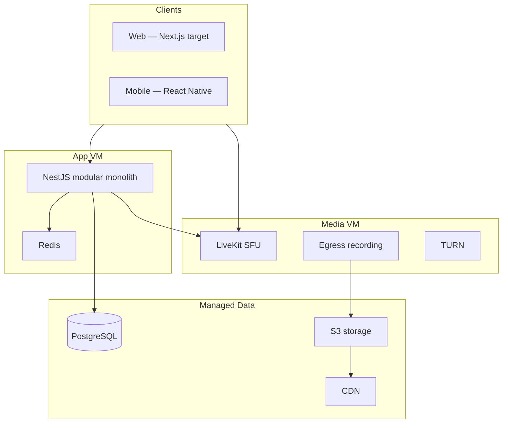

# Qur'an Learning Platform (QLP) — Product & Engineering Plan

> **Sources:** [Architecture & Delivery Plan PDF](Quran_Platform_Architecture_and_Delivery_Plan.pdf) · [Deployment & Cost PDF](Quran_Platform_Deployment_and_Cost_Comparison.pdf)  
> **Living docs:** [backlog.md](backlog.md) · [architecture.md](architecture.md) · [deployment.md](deployment.md) · [product-vision.md](product-vision.md)

## Executive Summary

A community platform connecting learners with **verified teachers** for live, in-platform Qur'an instruction — **one-to-one and group** video sessions, **session recording**, and an **on-demand lesson library**. Two constraints shape every decision:

1. **Minimize infrastructure cost** while real budget is available
2. **No third-party calling** — nothing routes through Zoom, Google Meet, or similar

---

## Vision

Connect Muslim learners worldwide with verified teachers. All video is native to the platform via **LiveKit**. Recordings and teacher uploads share one VOD pipeline. Teachers are credentialed (ijazah) and admin-verified. Open sessions require moderation from day one.

---

## Guiding Principles

- **Modular monolith** (NestJS) until scale demands microservices
- **Buy LiveKit** for real-time video; self-host later with **no app rewrite**
- **Managed DB first** (pilot); self-host app + video VMs
- **One unified video pipeline** — recordings and uploads are the same asset type
- **Cloud choice = data residency**, not habit

---

## Target Architecture

| Layer | Target | Current prototype |
|-------|--------|-------------------|
| Web | Next.js (SSR for public pages) | React + Vite SPA ✅ |
| Mobile | React Native | Not started |
| Backend | NestJS modular monolith | NestJS ✅ |
| Video | **LiveKit** (Cloud → self-hosted) | Mock/Daily stub 🟡 |
| DB | Managed PostgreSQL | Docker Postgres ✅ |
| Storage | Managed S3 + CDN | MinIO locally ✅ |
| Auth | Email + phone/OTP | Email only 🟡 |

---

## Backend Modules (Target)

| Module | Scope |
|--------|-------|
| Identity & Profiles | Auth, teacher credentials, i18n |
| Community & Matching | Directory, study circles, preferences |
| Sessions & Scheduling | Meetings, booking, reminders |
| Video Orchestration | LiveKit tokens, rooms, webhooks |
| Recording & VOD | Egress, transcode, library |
| Notifications | Email, in-app, reminders |
| Admin & Moderation | Approval, reports, host controls |

*Prototype also includes curriculum/progress/achievements — retained as structured learning layer.*

---

## Nine Epics (Work Breakdown)

| # | Epic | Sprint focus |
|---|------|--------------|
| E1 | Foundation and Identity | 1–2 |
| E2 | Scheduling and Meetings | 3–4 |
| E3 | Video Calls (Core) — LiveKit | 3–4 |
| E4 | Call Recording — Egress | 5–6 |
| E5 | Video Upload and VOD Library | 5–6 |
| E6 | Community and Matching | 7–8 |
| E7 | Trust and Moderation | 7–8 |
| E8 | Cloud Infrastructure and DevOps | 1–9 (continuous) |
| E9 | Scale-Out | Post-launch |

Full task breakdown: [backlog.md](backlog.md)

---

## Sprint Plan (~18 Weeks, 5–6 People)

| Sprint | Weeks | Goal |
|--------|-------|------|
| 1–2 | 1–4 | **Foundation** — CI/CD, auth (email+OTP), profiles, i18n/RTL |
| 3–4 | 5–8 | **Core Calling MVP** — meetings, LiveKit, call UI, access control |
| 5–6 | 9–12 | **Recording & Library** — Egress, upload, transcode, unified library |
| 7–8 | 13–16 | **Community & Trust** — matching, study circles, moderation, admin v1 |
| 9 | 17–18 | **Hardening & Launch** — security, load test, monitoring, soft launch |

---

## Deployment (Prototype ≤200 Users)

| Component | Choice | ~Cost/mo |
|-----------|--------|----------|
| App VM (backend + Redis) | Self-hosted | €6 |
| Media VM (LiveKit + TURN + Egress) | Self-hosted | €11 |
| PostgreSQL | **Managed** | €15 |
| Object storage | Managed | €5 |
| Maintenance labor (2h × €13) | — | €26 |
| **Total** | | **≈ €63/mo** |

Detail: [deployment.md](deployment.md)

---

## Highlighted Backlog Status

### Done / Partial (prototype codebase)

| Area | Status |
|------|--------|
| Monorepo, Docker, CI | ✅ |
| Email auth, RBAC, profiles | ✅ |
| Curriculum (Qaida), progress, achievements | ✅ |
| Tutor discovery, bookings, chat | 🟡 Partial |
| Admin (users, tutor verify) | 🟡 Partial |
| i18n EN/AR RTL | ✅ |
| LiveKit video | ⬜ Replace stub |
| Phone/OTP auth | ⬜ |
| Meetings model, open/closed sessions | ⬜ |
| Egress recording, VOD pipeline | ⬜ |
| Moderation tooling | ⬜ |
| Next.js / React Native | ⬜ |

---

## Open Questions

- Scale at launch and 12 months (concurrent sessions, users)
- In-Kingdom data residency — hard requirement or preference?
- Monetization model (not scoped)
- Gender-preference filter — explicit requirement?
- Team size confirmation (~5–6 assumed)

---

## Domain Considerations

- Qur'an text/audio via **Quran.com, Al Quran Cloud, Tanzil** — not built in-house
- Teacher **ijazah chain** in data model from day one
- **Gender-preference** filter optional in matching
- **Moderation** required for open/public sessions

---

## Glossary

| Term | Definition |
|------|------------|
| SFU | Selective Forwarding Unit — routes streams without re-encoding |
| Egress | LiveKit service that records/exports sessions to storage |
| HLS | HTTP Live Streaming for VOD and large passive audiences |
| Modular monolith | One deployable backend with clean domain modules |

---

## Reference Documents

- [Quran_Platform_Architecture_and_Delivery_Plan.pdf](Quran_Platform_Architecture_and_Delivery_Plan.pdf)
- [Quran_Platform_Deployment_and_Cost_Comparison.pdf](Quran_Platform_Deployment_and_Cost_Comparison.pdf)
