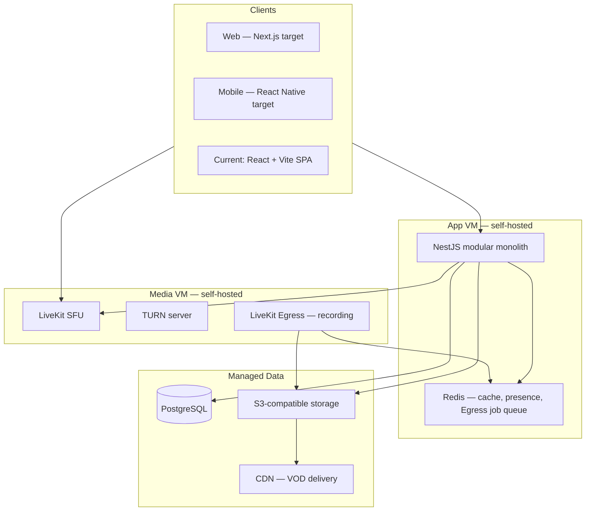

# QLP Architecture

Aligned with [Quran_Platform_Architecture_and_Delivery_Plan.pdf](Quran_Platform_Architecture_and_Delivery_Plan.pdf) and [Quran_Platform_Deployment_and_Cost_Comparison.pdf](Quran_Platform_Deployment_and_Cost_Comparison.pdf).

## Executive Summary

A **modular monolith** backend orchestrates identity, scheduling, community, and video. **LiveKit** handles all real-time media (SFU + Egress recording). Recordings and teacher uploads feed one **VOD pipeline**. Prototype deployment (≤200 users): self-hosted App VM + Media VM, managed PostgreSQL + object storage.

## System at a Glance



> **Current codebase:** `apps/web` is a React + Vite SPA (prototype). Target production web stack is **Next.js** for SSR on public pages (teacher profiles, published recordings). **React Native** for mobile is planned post-prototype.

## Guiding Principles

| Principle | Decision |
|-----------|----------|
| Backend shape | Modular monolith (NestJS domain modules) until scale requires split |
| Video | **LiveKit** — start Cloud for zero-ops dev; migrate to self-hosted on Media VM without app rewrite |
| No third-party calls | All video in-platform — no Zoom/Meet links |
| Video pipeline | Unified `videos` table + transcode pipeline for recordings **and** uploads |
| Data | Managed PostgreSQL (pilot); Redis on App VM; S3-compatible object storage |
| Search | PostgreSQL full-text initially; dedicated search only when proven necessary |

## Backend Modules (Target)

| Module | Responsibility | Current status |
|--------|----------------|----------------|
| **Identity & Profiles** | Auth (email + phone/OTP), user/teacher profiles, i18n | Partial — email auth, profiles, EN/AR RTL |
| **Community & Matching** | Teacher directory, filters, study circles, preferences | Partial — tutor discovery; no study circles |
| **Sessions & Scheduling** | Meetings, participants, booking, reminders, timezones | Partial — bookings; no meetings/participants model |
| **Video Orchestration** | LiveKit token service, room lifecycle, webhooks, access control | Stub — mock/Daily placeholder; **migrate to LiveKit** |
| **Recording & VOD** | Egress, metadata, access inheritance, transcode, library UI | Not started |
| **Notifications** | Reminders, in-app, email | Not started |
| **Admin & Moderation** | Teacher approval, reports, mute/remove, host controls | Partial — user/tutor admin; no moderation |
| **Curriculum & Progress** | Structured tracks, lesson progress, achievements | Implemented (prototype extension) |

## Video Architecture

### Live calls
- One scheduled meeting → one LiveKit room
- 1:1 and group use the same mechanism; token count differs
- Server-minted short-lived tokens scoped to room + publish/subscribe permissions
- **Open vs. closed** session access control
- **Silent/observer** join — publish withheld for watch-only audience

### Recording (Egress)
- LiveKit Egress runs **separate** from live call path (recording load cannot degrade calls)
- Room Composite mode → object storage
- Recording inherits source session access level (closed session → private recording)

### Upload & VOD
- Pre-signed URL → direct browser-to-storage upload (not proxied through API)
- Shared transcode pipeline → adaptive-bitrate output → CDN
- Same metadata table for recordings and uploads

## Data Layer

| Store | Purpose |
|-------|---------|
| **PostgreSQL** | Users, credentials, sessions, matching, video metadata |
| **Redis** | Cache, live presence, pub/sub, Egress job queue (shared from App VM) |
| **Object storage** | Recordings, uploads, avatars |
| **CDN** | VOD and static asset delivery |

## Domain-Specific Integrations

- **Qur'an content:** Quran.com, Al Quran Cloud, or Tanzil APIs — do not build corpus in-house
- **Teacher verification:** ijazah chain and credential fields in data model from day one
- **Gender-preference filter:** optional matching/booking filter — cheap now, expensive later
- **Moderation:** report, mute, remove-participant, host controls — required for open sessions

## Deployment (Prototype — ≤200 Users)

From deployment PDF — decision: **app + video self-hosted; database managed**.

| Component | Prototype choice | Notes |
|-----------|------------------|-------|
| App VM | Self-hosted (≈€6/mo) | Backend + Redis |
| Media VM | Self-hosted (≈€6–11/mo) | LiveKit + TURN + Egress; separate public IP |
| PostgreSQL | **Managed** (≈€15/mo) | Backups/auto-recovery during pilot |
| Object storage | Managed S3-compatible (≈€5/mo) | Recordings + uploads |
| **Total steady-state** | **≈€63/mo** | ≈€37 infra + ≈€26 maintenance labor |

Egress on Media VM uses Redis on App VM as its job queue — one shared dependency.

### Local development

```bash
docker compose up -d   # Postgres, Redis, MinIO (mirrors managed services locally)
npm run dev            # API + web
```

### Cloud residency options

- **Hard in-Kingdom:** Oracle Cloud (Jeddah/Riyadh), GCP Dammam; AWS Saudi announced
- **Preference only:** AWS/Azure UAE regions viable near-term

## Scaling Path (Post-MVP)

- Large broadcasts: Egress → HLS → CDN (decouple audience from SFU capacity)
- Multi-region LiveKit node pools when latency matters
- Self-hosted LiveKit migration when usage crosses managed per-minute breakeven
- Kubernetes introduced specifically for self-hosted LiveKit, not for core app initially

## Current Repo Layout

```
qlp/
├── apps/
│   ├── api/          # NestJS modular monolith
│   ├── web/          # Learner React + Vite (prototype; target Next.js)
│   └── admin/        # Admin console React + Vite
├── packages/
│   ├── api-client/
│   ├── hooks/
│   └── lib/
└── docs/
```

See [deployment.md](deployment.md) for cost comparison detail and [backlog.md](backlog.md) for epic/sprint alignment.
